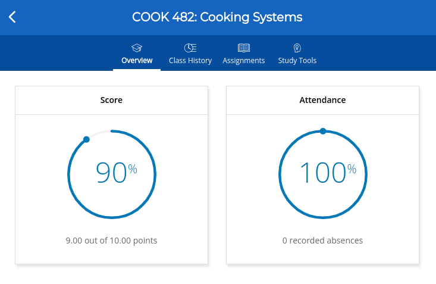

# iClicker Class Join Alarm

**Disclaimer: This script is intended for study purposes, specifically to learn and practice coding and automation with Tampermonkey. It should not be used to skip classes or abuse attendance systems. Please ensure you comply with your institution's attendance policies and use responsibly.**

This is a Tampermonkey userscript designed to automatically detect when the instructor starts taking attendance on the iClicker student page by identifying the keyword ("course-join-container expanded") in the HTML source. When the keyword is found, the script plays an alarm and sends a notification. If the keyword is not found after 30 seconds, the page will automatically refresh to ensure you don't miss any updates.

## Features

- Automatically checks the page every second for the keyword indicating attendance has started.
- Plays an alarm and shows a notification when the keyword is found.
- Stops the page from refreshing once the keyword is detected.
- If the keyword isn't found within 30 seconds, the page will refresh to keep it up-to-date.

## Test Script

For testing purposes, a separate script named `iclicker_join_class_alarm_test.user.js` has been added. This script will trigger the alarm regardless of whether attendance has started or not, allowing you to test the functionality of the alarm and notification.

## Known Limitations

- Due to modern browser restrictions, the alarm **may not play automatically**. It's a browser security feature that disables video/audio autoplay without user interaction and there's nothing I can do about it.
  - A possible way to bypass this restriction is to have some interactions first: 1. Enter the course page; 2. Click "Class History"; 3. Click "Overview". By doing so, the browser records your interaction, thus allowing autoplay.
- **Focus mode or similar settings must be turned off to receive notifications**.

## How to Install and Use with Tampermonkey

1. **Install the Tampermonkey extension**:
   - If you haven't installed Tampermonkey yet, you can download it from [the official Tampermonkey website](https://www.tampermonkey.net/) or:
     - [Tampermonkey for Chrome](https://chromewebstore.google.com/detail/tampermonkey/dhdgffkkebhmkfjojejmpbldmpobfkfo)
     - [Tampermonkey for Firefox](https://addons.mozilla.org/en-US/firefox/addon/tampermonkey/)
     - [Tampermonkey for Edge](https://microsoftedge.microsoft.com/addons/detail/iikmkjmpaadaobahmlepeloendndfphd)
     - [Tampermonkey for Safari](https://apps.apple.com/us/app/tampermonkey/id1482490089)

2. **Install the main script**:
   - Click [here to install the script](https://github.com/zpatronus/iclicker_join_class_alarm/raw/refs/heads/main/iclicker_join_class_alarm.user.js) or copy and paste the following URL into your browser:

     ```
     https://github.com/zpatronus/iclicker_join_class_alarm/raw/refs/heads/main/iclicker_join_class_alarm.user.js
     ```

   - Tampermonkey will prompt you to install the script. Click **Install**.

3. **Install the test script** (for test/debug only):
   - Click [here to install the test script](https://github.com/zpatronus/iclicker_join_class_alarm/raw/refs/heads/main/iclicker_join_class_alarm_test.user.js) or copy and paste the following URL into your browser:

     ```
     https://github.com/zpatronus/iclicker_join_class_alarm/raw/refs/heads/main/iclicker_join_class_alarm_test.user.js
     ```

   - Tampermonkey will prompt you to install the test script. Click **Install**.

4. **Use the script**:

   - Enter the course page. You should see this:

     

   - (Optional) Click "Class History", and then click "Overview" to bypass autoplay restrictions if the alarm does not work and you want not just notifications.
   - Once installed, the main script will automatically run on that page.
   - It will check for the keyword every second, and if found, will stop refreshing the page and trigger an alarm and notification.
   - You should turn it off when you are doing quiz, or it will refresh the page.

5. **Audio Autoplay Restriction**:
   - Due to browser restrictions on autoplay, the alarm may not play automatically.

## Compatibility

The following combinations have been tested:

- Ubuntu 20.04
  - Chrome
  - Edge
- Windows
  - Edge
- MacOS
  - Chrome

## License

This project is licensed under the MIT License.
